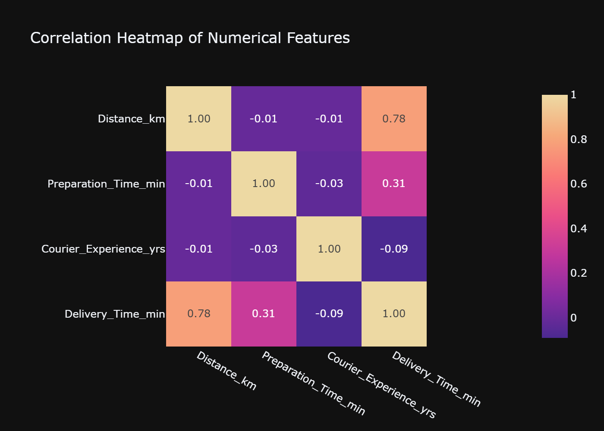
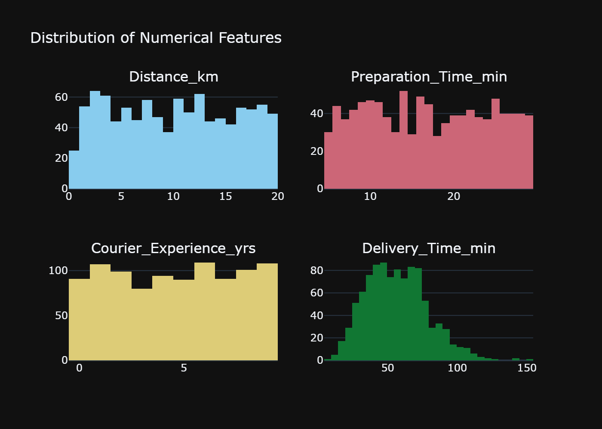
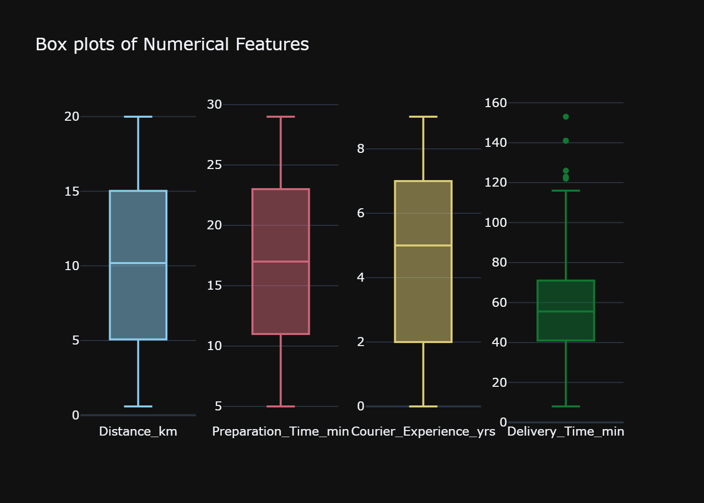
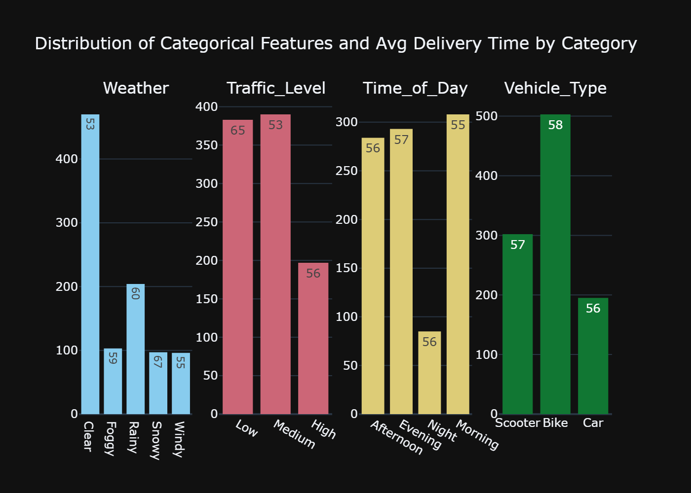
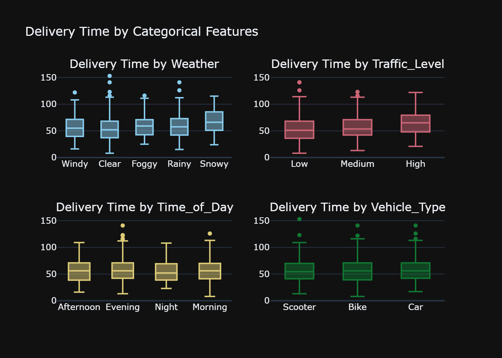
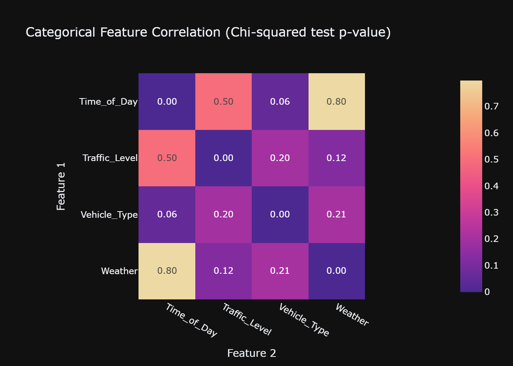
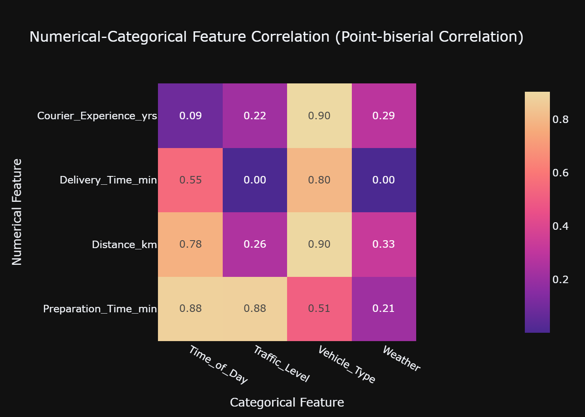

# EDA report

Dataset by Den_Kuznetz on Kaggle: [Food Delivery Time Prediction](https://www.kaggle.com/datasets/denkuznetz/food-delivery-time-prediction/data?select=Food_Delivery_Times.csv).

## Dataset description

These dataset was synthetically generated using statistical distributions and logical relationships to mimic real-world scenarios in food delivery.

Key features:

* Order_ID: `int` unique identifier for each order. 
* Distance_km: `float` delivery distance in km.
* Weather: `str` weather conditions during the delivery.
    * Categories: Clear, Rainy, Snowy, Foggy, Windy.
* Traffic_Level: `str` traffic conditions.
    * Categories: Low, Medium, High.
* Vehicle_Type: `str` type of vehicle used for delivery.
    * Categories: Bike, Scooter, Car.
* Preparation_Time_min: `int`time required to prepare the order, measured in minutes.
* Courier_Experience_yrs: `int` experience of the courier in years.
* Delivery_Time_min: `int` **Target variable** total delivery time in minutes.

## Numerical Features exploration

Exploratory analysis for numerical features. Order_ID is excluded from this analysis because it is only used as an identifier.

The correlation heatmap shows that there is no significant correlation between predictor variables, therefore no problem with multicollinearity. This affirmation is only true for numerical features at this moment, more analysis with categorical values need to be made before ruling out multicollinearity problems in the dataset.

As expected, there is significant positive correlation between delivery distance and time; weak correlation between preparation and delivery time, and almost no correlation between the couriers experience and their delivery time.

Kolmogorov-Smirnov test was performed to all numerical features to check whether they follow a normal, uniform or gamma distribution. `Distance_km` and `Preparation_Time_min` features follow an uniform distribution, and even when `Courier_Experience_yrs` p-value didn't account for an uniform distribution, its histogram shows behavior similar to a uniform distribution. Meanwhile, `Delivery_Time_min` resembles a gamma distribution. 

No predictive feature has outliers. The target variable `Delivery_Time_min` has 5 outliers greater than the upper fence that account for 0.5% of the data.

## Categorical Features Exploration

This analysis includes the rest of features in the dataset: weather, traffic level, time of day and vehicle type, as well as their interaction with the target delivery time.

The distribution per category of each variable is not homogeneous. There are significant differences that could affect the learning mechanism of a Machine Learning model.

At first glance there seems to a correlation between some categorical values and the target:

* The avg delivery time on days of clear weather is 7 min faster than rainy days and the difference doubles for snowy days.
* Unlike what would be expected, on average deliveries take the longest on days with lower traffic level.
* However, there is no significant difference in the average delivery time across time of day or vehicle type.

Comparing the behaviour of the delivery time across different categories, most of the data has the same dispersion and skewness regardless of the category. Although there are slight differences in the median across different categories, as discussed above regarding the average per category.

Since Pearson's correlation cannot be used to identify correlation between categorical variables, a Chi-squared test was applied to identify possible multicollinearity between categorical features. Based on an $\alpha$ = 0.05, there is no significant correlation in any two pair of variables.

# Numerical-Categorical Feature Correlation

Since the dataset has categorical and numerical variables, it is necessary to perform a final correlation test to ensure that there exists no multicollinearity between any pair of variables. 

Considering an $\alpha$ = 0.05 for the Point-biserial Correlation, there is no significant correlation between any predictor variables. Whilst there is a correlation between the target `Delivery_Time_min` and two categorical variables,`Traffic_Level` and `Weather`, as previously discovered when analyzing the average by category.

Since no pair of variables have a significant correlation, a PCA would not be suitable for this case. This also guarantees better interpretability of possible models based on the original features of the dataset.

Furthermore, with little correlation between variables, missing values cannot be filled based on other columns and should be filled according the variable distribution or dropped from the model.