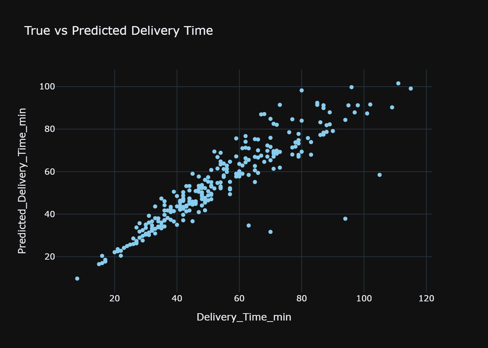
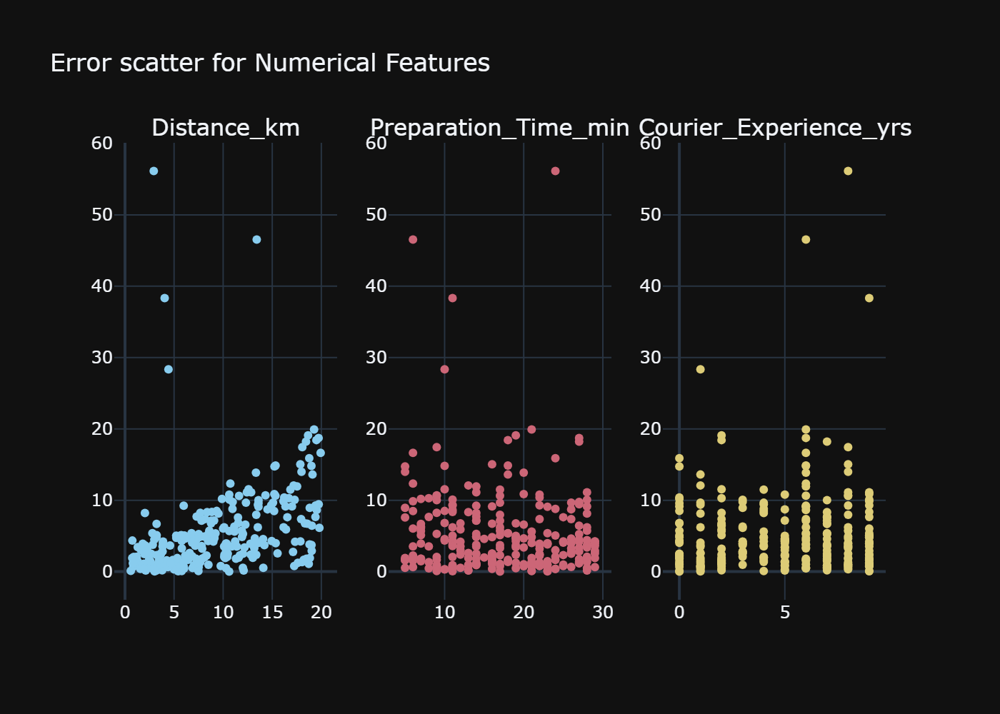
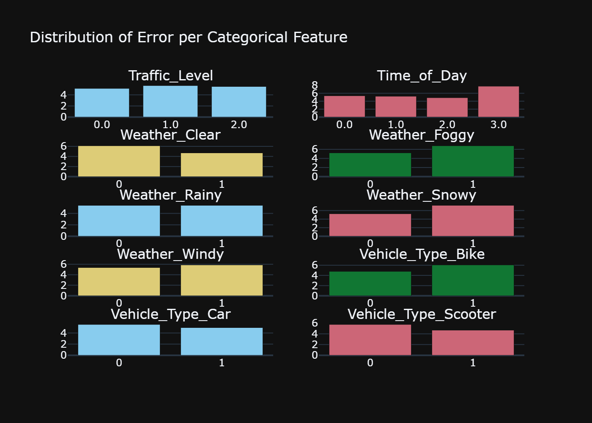

# Error insights

## General metrics

The Linear Regression model was selected by choosing the greatest score (coefficient of determination) from all computed trials. This measure indicates the proportion of variance of a dependent variable explained by the predictor variables in a regression model.

The R2 score is proportional to the MSE error and is commonly used to choose the best model. Although the MAE and MAPE were also calculated to undertand better the error metrics.

MAE stands for Mean Absolute Error and returns the average magnitude of error between predicted and true values in a regression model. It is easy to interpret because it has the same units as the target variable. For this model, the MAE is 5.4083, wich means that the predicted delivery time is on average $\pm$ 5 minutes and a half the real value.

The Mean Absolute Percentage Error helps to understand the performance of a model without an unit measure by providing the average percentage error. It helps to understand the performance across models even when the business data changes across time. The linear regression MAPE is 0.0981, which states that on average the delivery time has an 9.81% error.

The dispersion of the error across the delivery time suggests that the model has a weaker performance for longer deliveries. This could be driven by missing features that are not contemplated on the current data set that may have a bigger impact on longer delivery times.

## Insights by feature

For numerical features, there are some outliers that distribute across each feature. `Distance_km` error does shows a positive trend that could be further reduced with feature engineering. `Preparation_Time_min` and `Courier_Experience_yrs` show a more random distribution with a low number of outliers.

The categorical functions have similar average error to the numerical features, although higher error difference between categories for each feature show that further feature engineering and sampling balance should be done to reduce the variance for each category.

# Model failure

Since the error across the model is not randomly distributed, the model can be further optimized by feature engineering but it also fails consistently when the order has not the perfect conditions, such as foggy or snowy weather and night time. This could mean that some variables have not been accounted on the model or that the entropy for those variables cannot be identified or predicted within the model.